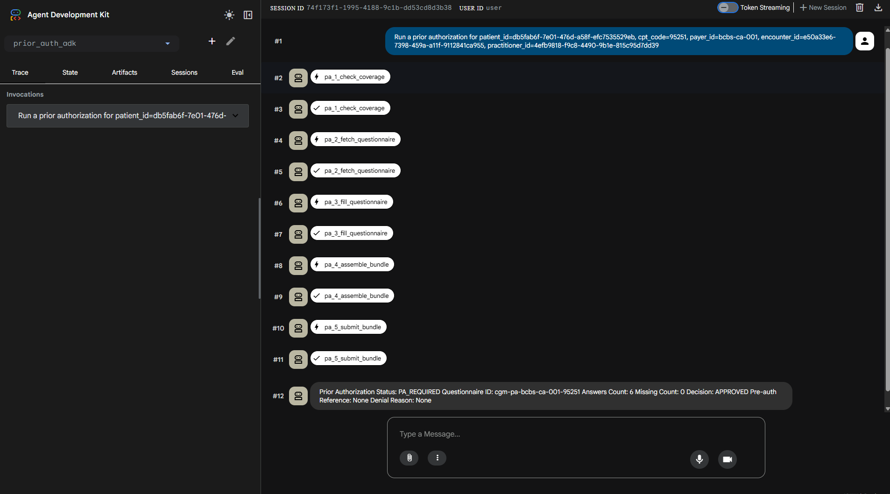
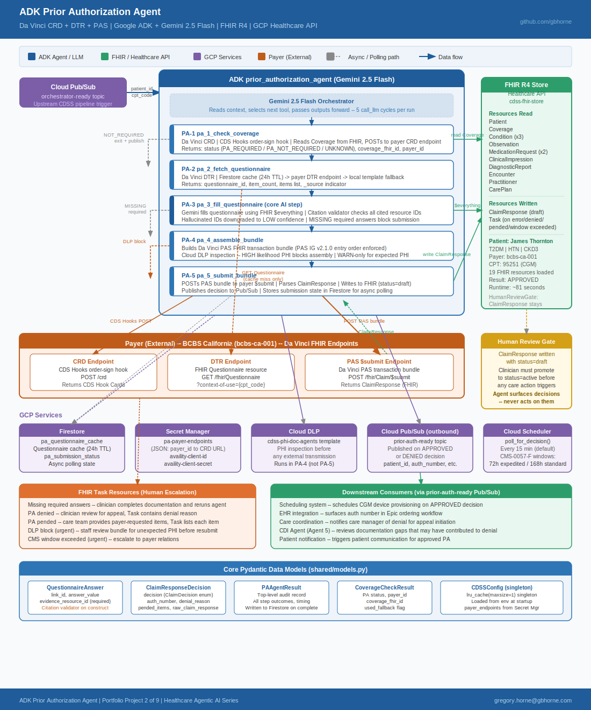
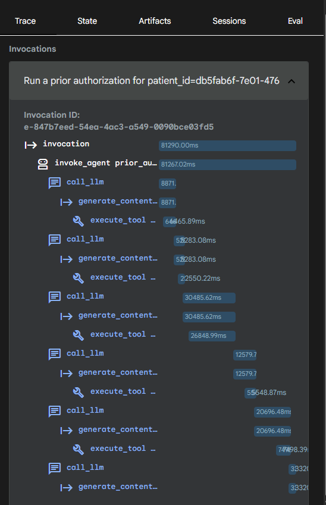

# ADK Prior Authorization Agent

> **Disclaimer: All patient data, payer identifiers, clinical records, and submissions in this repository are entirely fictitious and generated for demonstration purposes only. No real patient information is used.**



*ADK Web UI showing the Prior Authorization Agent completing a full Da Vinci PA pipeline. The agent runs 5 sequential tool invocations (PA-1 through PA-5: coverage check, questionnaire fetch, questionnaire fill, bundle assembly, and payer submission) and returns an APPROVED decision with pre-auth reference number. Each step is individually traceable in the Trace panel.*

A production-grade **Prior Authorization Agent** that automates the full PA lifecycle for healthcare services - from coverage verification through payer submission - using the [Da Vinci CRD/DTR/PAS](https://hl7.org/fhir/us/davinci-pas/) trilogy and Google Cloud Healthcare FHIR R4.

The agent runs end-to-end in the **ADK Web UI**, with each pipeline step visible as a distinct tool invocation orchestrated by Gemini 2.5 Flash.

---

## What It Does

A clinician orders CPT 95251 (Continuous Glucose Monitoring) for a patient with Type 2 Diabetes. The agent autonomously:

1. **PA-1** - Calls the payer's CDS Hooks CRD endpoint to determine if PA is required
2. **PA-2** - Fetches the payer's DTR questionnaire (with Firestore cache)
3. **PA-3** - Uses Gemini to answer each questionnaire item with citations to real FHIR resources
4. **PA-4** - Assembles a Da Vinci PAS-compliant FHIR transaction bundle and runs Cloud DLP audit
5. **PA-5** - Submits to the payer's `$submit` endpoint, writes the ClaimResponse to FHIR, and publishes the decision to Pub/Sub

**Result:** `Decision: APPROVED` - ClaimResponse written to Google Cloud Healthcare FHIR R4 store, downstream systems notified via Pub/Sub.

---

## Architecture



### How it works - LLM orchestration internals



Each pipeline step is registered as an ADK `FunctionTool`. Gemini orchestrates the sequence - deciding which tool to call next, passing outputs between steps, and handling early-exit conditions (PA not required, missing questionnaire answers, DLP blocks). The trace view shows 5 `call_llm` → `execute_tool` cycles with a total wall-clock time of ~81 seconds end-to-end.

---

## Stack

| Layer | Technology |
|-------|-----------|
| Agent framework | [Google ADK](https://github.com/google/adk-python) 1.26 |
| LLM | Gemini 2.5 Flash |
| FHIR | Google Cloud Healthcare API R4 |
| PA standard | Da Vinci CRD + DTR + PAS (HL7 FHIR) |
| Compliance | CMS-0057-F (payer interoperability rule) |
| PHI audit | Cloud DLP |
| State / cache | Firestore |
| Messaging | Cloud Pub/Sub |
| Auth secrets | Secret Manager |
| Runtime | Python 3.11 · Cloud Run (prod) |

---

## Project Structure

```
adk-prior-authorization-agent/
├── agents/prior_auth/
│   ├── adk_agent.py          # ADK root_agent + 5 FunctionTools
│   ├── agent.py              # Core pipeline orchestrator
│   ├── prompts.py            # Gemini prompt templates
│   └── tools/
│       ├── coverage_check.py     # PA-1: CDS Hooks CRD
│       ├── dtr_fetch.py          # PA-2: DTR questionnaire
│       ├── questionnaire_filler.py # PA-3: Gemini Q&A
│       ├── bundle_assembler.py   # PA-4: PAS bundle + DLP
│       └── pas_submit.py         # PA-5: $submit + FHIR write
├── shared/
│   ├── config.py             # CDSSConfig + Secret Manager
│   ├── fhir_client.py        # Google Cloud Healthcare FHIR client
│   └── models.py             # Pydantic models
├── scripts/
│   ├── mock_payer_server.py  # Local CRD/DTR/PAS mock (aiohttp)
│   ├── load_synthetic_patient.py # FHIR test data loader
│   ├── test_unit.py          # 15 unit tests
│   └── test_integration.py   # 6 integration tests (live GCP)
├── data/
│   ├── test_ids.json         # Synthetic patient server UUIDs
│   └── questionnaire_templates/  # Local DTR fallback templates
└── prior_auth_adk/
    └── agent.py              # ADK entrypoint (imports root_agent)
```

---

## Patient

The agent works with any patient, payer, and CPT code combination supported by a Da Vinci-compliant payer endpoint. The included synthetic dataset demonstrates one complete PA scenario:

| Field | Value |
|-------|-------|
| Patient | James Thornton (fictitious) |
| Conditions | Type 2 Diabetes, Hypertension, CKD Stage 3 |
| Payer | BCBS California (`bcbs-ca-001`) |
| CPT Code | 95251 - Continuous Glucose Monitoring |
| FHIR Resources | 19 R4 resources loaded into Google Cloud Healthcare API |
| Outcome | APPROVED |

To test with a different patient or payer, update `data/questionnaire_templates/` with the payer's questionnaire and update `scripts/load_synthetic_patient.py` with the patient's FHIR resources. No code changes are required — payer endpoints are configuration only via Secret Manager.

> All patient names, clinical records, and payer identifiers in this dataset are entirely fictitious and generated for demonstration purposes only.

---

## Running Locally

### Prerequisites

```powershell
# Clone and set up venv
git clone https://github.com/gbhorne/adk-prior-authorization-agent
cd adk-prior-authorization-agent
python -m venv .venv
.venv\Scripts\activate
pip install -r requirements.txt
pip install google-adk
```

Configure `.env`:

```env
GCP_PROJECT_ID=your-project-id
GCP_REGION=us-central1
FHIR_DATASET=cdss-dataset
FHIR_DATASTORE=cdss-fhir-store
FHIR_LOCATION=us-central1
GEMINI_MODEL=gemini-2.5-flash
```

### Run tests

```powershell
# Terminal 2 - start mock payer server
python scripts/mock_payer_server.py

# Terminal 1 - run test suites
pytest scripts/test_unit.py -v          # 15/15
pytest scripts/test_integration.py -v -s # 6/6
```

### Launch ADK Web UI

```powershell
# Terminal 2 - mock payer server must be running
python scripts/mock_payer_server.py

# Terminal 1
adk web
```

Open `http://127.0.0.1:8000`, select `prior_auth_adk`, and send:

```
Run a prior authorization for patient_id=db5fab6f-7e01-476d-a58f-efc7535529eb,
cpt_code=95251, payer_id=bcbs-ca-001,
encounter_id=e50a33e6-7398-459a-a11f-9112841ca955,
practitioner_id=4efb9818-f9c8-4490-9b1e-815c95d7dd39
```

Watch PA-1 through PA-5 execute in the UI with a final `APPROVED` decision.

---

## Test Results

```
scripts/test_unit.py          15 passed  ✓
scripts/test_integration.py    6 passed  ✓
```

Integration tests run against live GCP - real FHIR store, real Firestore, real Pub/Sub, real Secret Manager. Mock payer server handles CRD/DTR/PAS endpoints locally.

---

## Key Design Decisions

**Da Vinci trilogy end-to-end** - CRD (coverage discovery), DTR (questionnaire fetch with Firestore cache), and PAS ($submit with sync/async decision handling) all implemented per HL7 spec.

**Gemini as questionnaire filler** - PA-3 uses a structured Gemini prompt that cites specific FHIR resource IDs for each answer. A citation validator rejects hallucinated resource IDs and downgrades confidence rather than blocking submission.

**Human review gate** - ClaimResponse is written with `status=draft`. A clinician must promote it to `active` before it triggers any care action. The agent surfaces decisions - it never directly acts on them.

**Cloud DLP audit** - Every PAS bundle is inspected for PHI before submission. High-likelihood findings block submission; lower-likelihood findings warn and log.

**Firestore questionnaire cache** - DTR questionnaires are cached per payer+CPT with configurable TTL to avoid redundant payer round-trips.

---

## GCP Infrastructure

| Resource | Details |
|----------|---------|
| Healthcare API dataset | `cdss-dataset` (us-central1) |
| FHIR R4 store | `cdss-fhir-store` |
| Firestore | `(default)` native mode |
| Pub/Sub topics | `orchestrator-ready`, `prior-auth-ready` |
| Secrets | `pa-payer-endpoints`, `availity-client-id`, `availity-client-secret` |

---

## Framework Comparison

This agent was rebuilt using LangGraph to demonstrate deterministic graph orchestration, typed state, and native human-in-the-loop interrupts. The LangGraph version uses the same clinical pipeline and GCP stack but replaces Gemini-driven tool selection with an explicit StateGraph — every routing decision is code, every state transition is typed, and the clinician review gate is a native graph interrupt rather than an upstream workflow convention.

See the companion repo: [gbhorne/langgraph-prior-authorization-agent](https://github.com/gbhorne/langgraph-prior-authorization-agent)

---

## Author

**Gregory Horne** · [github.com/gbhorne](https://github.com/gbhorne)

---

> **Disclaimer:** All patient data, payer identifiers, clinical records, and submissions in this repository are entirely fictitious and generated for demonstration purposes only. No real patient information is used.
